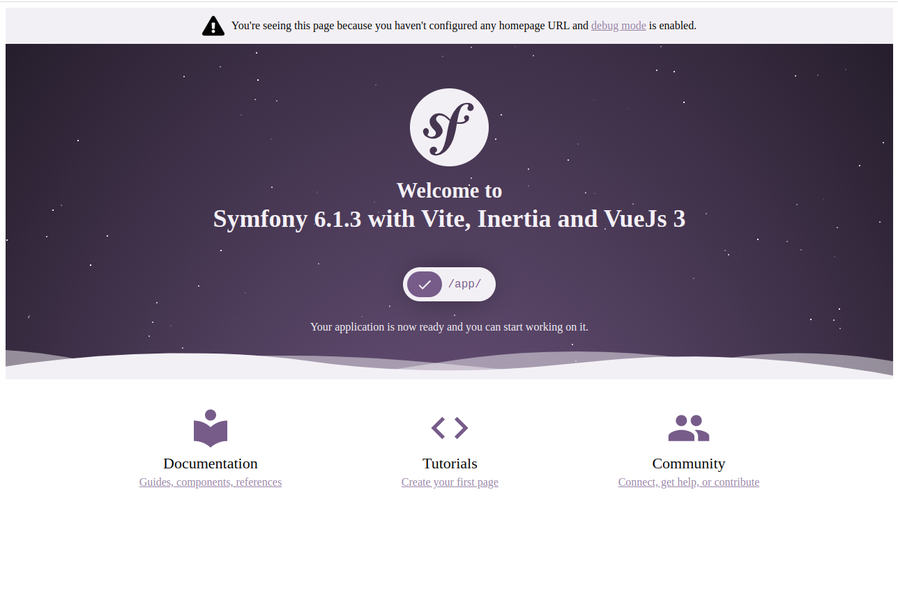

# Symfony + Vite + Inertia + Vuejs 3

This is a template for Symfony project with Inertia and Vuejs that uses Vite instead of Webpack

## Using this template

Follow this instruction in creating new repo from this template
https://docs.github.com/en/repositories/creating-and-managing-repositories/creating-a-repository-from-a-template

## Requirements

- PHP 8
- Composer
- Symfony CLI
- Node
- NPM

## Installation and Running

Before you do the steps, make sure you are installed PHP8, Symfony, Composer, NodeJs and NPM.

1. Install PHP Packages using Composer
```shell
composer install
```

2. Next install your node packages using npm
```shell
npm install
```

3. Run symfony server for backend
```shell
symfony server:start
```

4. Run node server for frontend dev env
```shell
npm run dev
```

5. Access http://localhost:8000 in your browser

You would see the modified vue version of symfony welcome



### Using Docker

If you are familiar with Docker container, you can run the application using it.

1. Change the `docker-compose.yml` if necessary like ports mapping to your host
2. Run docker compose
```shell
docker-compose up -d
```
3. Access http://localhost:8000 in your browser

As default it will map the port of the php to 8000 and inertia node to 13714

## Intertia / Vue Directory

The pages directory is located in `assets/`

- **pages** will be the template that you can use to render in your controller

## SSR

To change this configuration just change your .env files variables

| env                    | description     | type    | default                    |
|------------------------|-----------------|---------|----------------------------|
| APP_INERTIA_SSR_ENABLE | Enables the ssr | boolean | true                       |
| APP_INERTIA_SSR_URL    | The ssr url     | string  | http://node:13714/render   |

The default for the url is the container of docker setup.

This ssr configuration is following the ssr support of Inertia https://inertiajs.com/server-side-rendering

## References

- [Symfony](https://symfony.com/)
- [Symfony Inertia Bundle](https://github.com/rompetomp/inertia-bundle)
- [Symfony Vite Bundle](https://github.com/lhapaipai/vite-bundle)
- [Inertia Js](https://inertiajs.com/)
